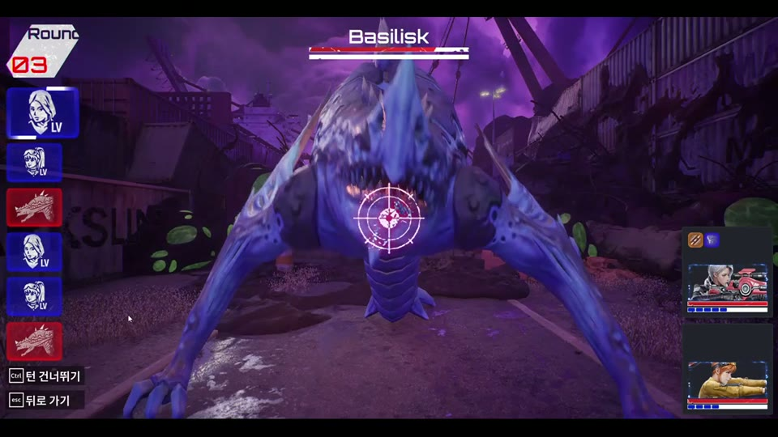
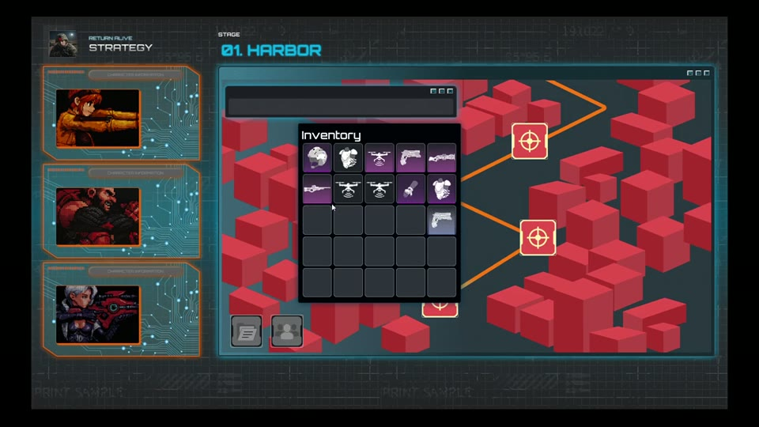

# Uni Birth

[프로젝트 PDF](docs/UniBirth.pdf)

> 이 저장소는 포트폴리오용 C++ 소스 아카이브입니다. 원본 Content와 `.uproject`가 없어 단독 실행할 수 없습니다.

'클레르 옵스큐어: 33원정대(Clair Obscur: Expedition 33)'의 실시간 방어 및 반응형 전투 시스템을 모티브로 개발한 Unreal Engine 5 기반 턴제 RPG 팀 프로젝트입니다.

### 프로젝트 상태

장비 사양(MSI GF63 Thin 9SC)으로 인해 Unreal Engine 에디터 렌더링 실행은 제외하였으나, C++ 소스코드 전반에 대한 언리얼 엔진 5 표준 코딩 컨벤션(UE5 Coding Standard) 적용 및 소스코드 리팩터링을 완료하였습니다.

README 업데이트: 2026-08-09

### 실행 빌드

- [Windows 디버그 메시지 비표시 빌드](https://github.com/a-i-am/UE5-Turn-based-RPG-Uni-Birth/releases/tag/debug-free-build-v1)
- 압축 해제 후 `Windows/UniBirth.exe` 실행

### 영상

| 포트폴리오 소개 영상 | 기능 흐름 시연 영상 |
| --- | --- |
| [](https://github.com/a-i-am/UE5-Turn-based-RPG-Uni-Birth/releases/download/portfolio-videos-v1/UniBirth-portfolio-overview-no-captions.mp4) | [](https://github.com/a-i-am/UE5-Turn-based-RPG-Uni-Birth/releases/download/portfolio-videos-v1/UniBirth-feature-flow-no-captions.mp4) |
| 전투, 탐색, UI 흐름을 중심으로 Uni Birth의 전체 플레이 분위기를 정리한 영상입니다. | 보상 획득, 인벤토리 조작/착용, 드론 착용 후 바실리스크 전투, 분해·조합 흐름을 보여줍니다. |

GitHub에서 큰 MP4 파일은 미리보기가 제한될 수 있어, 영상은 [Release asset](https://github.com/a-i-am/UE5-Turn-based-RPG-Uni-Birth/releases/tag/portfolio-videos-v1)으로 제공합니다. 썸네일을 클릭하면 브라우저 설정에 따라 영상이 바로 재생되거나 다운로드됩니다.

### 프로젝트 정보

| 항목 | 내용 |
| --- | --- |
| 개발 기간 | 2025-10 - 2025-12 |
| 리팩터링 상태 | C++ 소스코드 컨벤션 리팩터링 완료 (엔진 에디터 실행 제외) |
| 인원 | 기획 5인, 아트 5인, 개발 3인 |
| 엔진 | Unreal Engine 5.5.4 |
| 협업 | TortoiseSVN, Notion, Discord |


### 기술 스택
<p>
  
  
  
</p>

### 프로젝트 구조
```text
(프로젝트 구조도 추가 예정)
```

### 플레이 및 조작 방법
*(캐릭터 전투 진입, 회피/패링 입력 키 및 스킬 활용법 작성 예정)*

### 담당 작업

- 플레이어 회피·패링 QTE 시스템 로직 설계
- 스킬 버프와 디버프 적용 및 해제 구현
- 동일 등급 버프의 연쇄 합성 시스템
- 콤보 성공·실패와 버프 슬롯 상태 동기화
- 데이터 테이블(CSV) 기반 QTE 및 스탯 수치 연동

### 업데이트 계획

- 사용한 에셋 출처 표기 예정
